### The Domestic

Table 1: Glossary of Terms

## Start Here

This short introductory adventure aims to teach you the basics of Rivers of London: the Roleplaying Game .  Y ou  don't need to read the  rules  before  you  begin.  And,  if  you've  already  read  Ben's short story called 'The Domestic,' don't worry-we've added in some extra material, with Ben's permission, to give it a few new twists and turns.

One important note  before  you  dive  in:  don't  read  the  text from start to finish! In a solo adventure like this, you read one numbered section (an entry) at a time, and follow the instructions at its end to see what to read next. Sometimes you will have to roll dice to see if you succeed or fail-don't be tempted to cheat with these rolls. You won't necessarily have more fun if you always succeed. And, once you've finished,  you can always go back to the beginning and try a different path to see what would have happened if you'd made different choices. At the end of each entry you will find a number in parentheses-these are 'trace numbers' that show which entries may have led you there-meaning you can backtrack if you have to.

Gather the following: a blank character sheet (copy the one in this book or download one from chaosium.com), a pencil and eraser, and two ten-sided percentile dice ( Roleplaying Dice , page 13), or you can also use a dice-rolling app, if you have one. You are now ready to play Rivers of London: the Roleplaying Game ( RoL:RPG ). Go to entry 1 .

Adapted from the short story by Ben Aaronovitch.

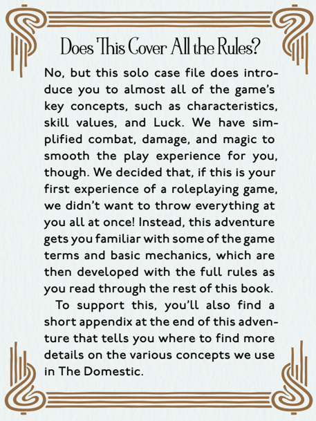

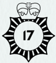

1

The 20-mph (32 kph) speed limit makes it easy to read the doors as you drive your Ford Escort east on Prince of Wales Road. The house numbers count down along a mishmash of terraces,  interrupted  only  by  the  pillared  front  of  a  former Methodist chapel, now a contemporary art centre with the obligatory café and gift shop. You find what you're looking for  in  the  low  hundreds  and,  by  some  miracle,  there  is  a parking space opposite, just wide enough for your car.

Safely wedged into the parking space, you take a moment to review the report. Verbal disagreements in the basement flat, three nights in a row. Two voices heard, getting louder each time. Culminating on the third night in an almighty crash  that  prompted  a  999  (emergency  services)  call  from the couple upstairs, the Romanian students next door, and a  cyclist  delivering  curry who was startled enough to drop his bag over the railing, ending up with an unholy amalgam of  tikka  masala,  korma,  and  saag  aloo.  The  responding officers  found  signs  of  a  struggle,  but  no  other  persons  on the premises.

You  step  from  the  car  to  see  an  unsympathetic-looking woman wearing a Hi-Viz safety jacket,  a  peaked  cap,  and an acid perm. She is a Civil Enforcement Officer, otherwise known  as  a  parking  warden.  She  notes  down  your  car's registration number.

You  begin  with  the  following  common  skills:  Athletics,  Drive, Navigate,  Observation,  Read  Person,  Research,  Social,  and Stealth. You also have the combat skills: Fighting and Firearms. All these skills begin with a value of 30%. Write the number 30 on your character sheet in the first space beside each of these skill names.

Now, decide what your job is: If you are a Police Officer, go to 9 . If you are a Social Worker, go to 42 . If you are a Nurse, go to 72 .

(Start)

2

The rush hour traffic begins to break as you chauffeur Ernie across  Euston  Road  and  back  north.  Somewhere  near Mornington  Crescent  he  starts  snoring.  You  stop  around the corner from Prince of Wales Road to pick up supplies. On your third circuit, a parking space opens up in front of Mrs Fellaman's flat and you cut up an aggrieved woman in a Chelsea tractor to secure the spot. It is seven o'clock.

Around eight, Ernie stirs. You watch him closely, but the way he whines and paws the door suggests no magic is involved. He lets you attach the lead and take him down a cul-de-sac for a comfort break. You capture the results in a latex glove and dispose of them lawfully. Ernie is willing to return to the car, which has remarkably not been ticketed during your three-minute absence. He shows no particular interest in Mrs Fellaman's flat and nods off again. You settle in to continue the stakeout.

Characters recover over time. If you were Hurt, you now return to normal; update your character sheet by erasing the 'Hurt' mark.

Go to 7 .

(106)

## 3

You hear the scuff of feet behind the door. It then opens and a little old woman sticks her head around the doorjamb. ' Yes? Can I help you? '

You ask if she is Mrs Eugenia Fellaman.

' Yes. ' Her eyes narrow. ' Are you with those two boys from earlier? ' You assure Mrs Fellaman you have come alone.

She opens the door and steps out, blinking. As she steps up and scans the street, you notice the faded purple of a bruise on her left cheek.

To ask her directly about the bruise, go to 14 . To wait for her to return to the door, go to 20 . To take the opportunity to look inside the house, go to 31 . To ask about these 'two boys,' go to 35 . To insist on coming in to talk, go to 46 .

(107)

4

Wild-eyed, Knuckles grits his teeth as he swings the heavy masonry hammer at you.

Knuckles is initiating an attack against you. His 'action' is to try to hit you with his hammer. His Fighting skill is 40/20 (which means Regular 40/Hard 20).

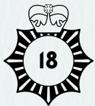

As the target  of  his  attack,  you  get  to  'respond.'  You  may  use  a combat  manoeuvre-a  special  type  of  attack-to  break  his grip  on  the  hammer.  Decide  whether  you  want  to  disarm  your opponent or flee.

Then  carry out an  opposed Fighting roll:  Knuckles  makes a  Fighting  roll  and  gets  a  Regular  success.  Make  your  own Fighting roll and compare the result to Knuckle's Regular success. Remember, a dice result of triple zero (100) is a fumble, while a 01 is a Critical success.

Compare  the  two  results:  Critical  success  beats  Hard  success; Hard success beats Regular success; Regular success beats fail; fail beats fumble.

If you win the opposed roll, go to 8 . If you lose the opposed roll, go to 12 . If it is a draw, go to 28 .

(6, 19, 56, 97)

5

You pull out of your precious parking space and turn south towards Russell Square, taking Camden Street to avoid the shuffling mass of tourists attracted to the Lock by overpriced hummus wraps, Doc Martens, and spicy noodles.  On  the edge of Somers Town you see a local butcher and pop out of the car for a necessary purchase.

The Folly occupies a Georgian terrace on the south side of  Russell  Square, a location it shares with the Council of British  International  Schools,  the  London  Mathematical Society, and a birdshit-covered statue of the fifth Duke of Bedford.  You  pull  into  the  garage  around  the  back.  DC Grant's Ford Focus ST, or 'Asbo,' is not there-a bad sign. But perhaps his dog Toby is still in residence.

Inside  the  Folly,  Toby's  basket  is  empty.  A  familiar  inkskirted  figure  glides  past,  her  gaze  moving  across  you  like a duster on a long-neglected shelf. This is the housekeeper, Molly.  You  work  up  some  courage  and  ask  her  if  you  can borrow the Folly's famed ghost-hunting dog. She stops and tilts  her  head  to  the  side,  the  black  almond-shaped  eyes beneath her mob cap skewering you where you stand. After an  awkward  silence,  you  repeat  the  request,  holding  up your sausages.

For a moment the meaty packet sits in your hand like a terrible, inadvertent insult. Then Molly straightens her head and glides to the door. She points to the far corner of the yard in a manner reminiscent of Donald Sutherland at the end of Invasion of the Body Snatchers.

Go to 11 .

(102)

6

A masonry hammer  pushes the glass inwards. Spiky fragments fall  to  the  floor  among  the  crockery.  The  heavy metal head runs around the frame, clearing the remaining spikes  before  its  wielder  steps  through.  He  is  a  square and  yobbish  twentysomething  with  a  bent  nose,  tattooed knuckles, and cold eyes.

' I told you there'd be consequences, Genie. You can't just borrow money and not pay it back. ' Knuckles notices the crockery on the floor. ' Strewth. Some other mob get here before us? '

A  second  man  steps  through  the  window,  with  a  flat cap,  a  bad  goatee,  and  a  missing  incisor.  He  points  at  you. ' Who's this? '

' A  witness, '  Knuckles  says.  He  hefts  the  hammer  and steps towards you. His body language says he is looking for a chance to use it. ' Beat it, ' he snarls.

If you are a Police Officer, you may identify yourself. Go to 19 . Otherwise, you may cast a spell, if you know one. To cast Impello , go to 26 . To cast Scindere , go to 69 . To tackle your attacker physically, go to 4 .

(101)

## 7

A little after nine o'clock the parking warden emerges from the  darkness,  light  from  the  streetlamps  glinting  on  her Hi-Viz jacket. She takes a momentary interest in the Escort, but seeing you behind the wheel, she rolls her eyes and moves on. Ernie growls from the back seat.

Although resentment of traffic wardens could be his natural inclination, you turn around to calm your borrowed dog. He is  not  reacting  to  the  traffic  warden.  His  ears  are  forward, his tail straight back. He stares at the building, his attention completely focused on the basement flat, and barks twice.

This is as good a confirmation of supernatural activity as you will get, and judging from the witness reports, indicates the presence of a ghost. You slip out of the Escort and shut Ernie inside. From the pavement, you can hear an argument. A  raised  voice,  Mrs  Fellaman's,  and  then  a  response-a younger, deeper,  male  voice.  It  is  followed  by  the  crash  of breaking crockery.

To knock firmly on the door, go to 13 .

To slip around the back, go to 33 .

To  draw  Mrs  Fellaman  out  by  tapping  on  the  window  and hiding, go to 70 .

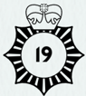

8

You step inside the hammer's swing, closing to an intimate distance and negating Knuckles' advantage.

If you decided to disarm your opponent, go to 23 . If you decided to flee from the fight, go to 109 .

(4, 28, 34)

9

You  show  your  warrant  card  to  the  parking  warden.  She grimaces.  It's  understandable,  working  as  she  does  for  the Parking  Operations  Operations  Team  (POOT),  formerly the Parking Services Operations Team (before that, it was the  Parking  Services  Enforcement  Team).  She  eyes  your plainclothes and the Ford Escort.

' Are you on official business? '  she  asks,  stylus  poised  above her  battered  handheld  computer,  desperately  holding  onto the fraying threads of her authority.

You are a Police Officer attached to the Folly. Note down Police Officer as your Occupation. You have the expert skills of Law 60% and Magic 60%. Write these skills and their starting values of 60 down in the space for expert skills on your character sheet.

Now, choose four of your common skills and raise them from 30% to 60%. Your starting skills are ready.

Finally, roll your ten-sided 'units' die twice (usually written as 2D10) and add the result to 50. This is your starting Luck. So, if you rolled 3 and 8, your result would be 3+8+50 = 61. Note down your starting  and  current  Luck  in  the  spaces  provided.  For  the moment, these numbers are both the same, but that may change as this adventure continues.

Go to 17 . (1)

## 10

Mrs Fellaman heads for the kitchen. You take a moment to survey the flat. Ignoring a chair with its legs broken and the fragments of crockery strewn across the floor, you can see the Victorian  origins  of  the  building-this  flat  was  previously the servants' quarters, as well as the kitchen and coal bunker. Everything is crammed into a tight space with a low ceiling. The fireplace is bricked up.

You have a moment to consider how to handle the ghost in this place. A magical intervention will be required.

lux ,  which you used to master the spell Werelight. You have not yet practised enough to learn a second order spell combining two forma .  But you have learned a second forma and can use it for another first order spell.

If you decided to learn Impello , which moves an object, go to 21 . If  you  decided  to  learn Scindere ,  which  holds  an  object  in place, go to 30 .

(18, 22, 65, 83, 96, 100, 108)

## 11

From the corner of the yard, behind the bins, comes the sound of bestial rage and mortal combat. Something in the shadows tears  through  plastic  and  cardboard,  snarling  through  its teeth. It does not sound much like Toby the Ghost-hunting Dog, who has a generally amiable personality, with a distinct affinity for anybody providing food.

To sneak up to the bins and look behind them, go to 15 . To continue surveillance from a distance, go to 24 .

(5)

## 12

You try to step back from the swing, but the heavy hammer smashes into your shoulder and knocks you off-balance.

Mark down that you take 2 damage. If you have suffered 2 damage in total,  you  are  Bloodied,  and  so  mark  the  Hurt  and  Bloodied boxes on your character sheet and go to 34 .

If you have suffered a total of 3 or more damage, you are Down, and so mark the Down box on your character sheet and go to 78.

(4, 28, 34)

## 13

You descend the iron stairs. As you hear another plate shatter, you rap on the door. Immediately all noise ceases from inside. Nothing moves for 30 seconds.

You lift  up  the  letterbox  and  yell  to  Mrs  Fellaman  that you know she's in there and you don't intend to leave. After a  prolonged pause, you hear the scuff of reluctant feet and the door opens once more. Anger and guilt battle on Mrs Fellaman's face.

' What do you want this time? ' she says.

Spells  in RoL:RPG are  cast  by  forming  shapes  in  the  mind ( forma ). First order spells use only a single forma .  DCI Nightingale, the Folly's resident master of magic, has taught you

If you are a Police Officer, go to 18 .

If not, make a Power (POW) roll. If you succeed, go to 22 ; if you fail, go to 27 .

(7, 49)

## 14

Mrs Fellaman stops as you ask about the bruise. She very deliberately does not lift her hand to her cheek.

' I walked into the door, didn't I? ' she says. ' You get like that when you're a bit older. '

You find a gentle way to say that neither of you believes that.  She  screws  up  her  nose  and  pushes  past  you,  back into the doorway.

Look  at  the  characteristics  on  your  character  sheet.  You  have Strength (STR) 80. Write it down in the first space beside the characteristic name. When you make a STR roll, you will attempt to roll equal to 80 or lower.

In the second space beside the characteristic name, write down half of that value. In this case, write down 40. When you make a Hard STR roll, you will attempt to roll equal to 40 or lower.

To wait patiently for Mrs Fellaman to invite you inside, go to 61 . To look for anything that might facilitate illicit entry, go to 71 . To ask about the 'two boys,' go to 76 . To insist on looking inside the house, go to 82 .

## (3)

## 15

The volume of the snarling and rending increases as you pad across  the  yard  and  press  yourself  against  the  wall  to  look behind the bins. Abruptly, the noise stops.

Make a Stealth roll. Remember, roll 1D100 and attempt to get your Stealth skill value or less.

Any time you make a skill or characteristic roll,  you  may  spend Luck to improve that roll. So, if you needed 30, but rolled 39, you can choose to spend 9 points of Luck to improve the roll and succeed. Of course, later in the adventure, you may wish you still had those Luck points!

If  you  do  spend  Luck,  don't  forget  to  update  your  current  Luck value on your character sheet.

If you succeed at the Stealth roll, go to 29 . If you fail at the Stealth roll, go to 40 .

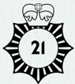

## 16

Knuckles begins to disengage from the fight. He edges his way towards the back window.

Continue  the  combat.  If  your  opponent  was  the  last  person  to take their combat action, it is now your turn and vice versa. His Fighting skill is 40/20.

Carry  out  an  opposed Fighting roll:  make  a  Fighting  roll  for Knuckles and then one for yourself. Triple zero (100) is a fumble; 01 is a Critical success.

Compare  the  two  results:  Critical  success  beats  Hard  success; Hard success beats Regular success; Regular success beats fail; fail beats fumble.

You can still spend Luck to resolve a tie.

If you win the opposed roll, go to 64 . If you lose the opposed roll, go to 103 .

(43, 62, 89)

## 17

You tell the parking warden that you are on official business and  ask  if  she  is  often  in  this  area  late  in  the  evening. Disappointed, she jabs her stylus at a small notice on a pole across the road that says ' Permit holders only until 11 pm. ' She replies, ' So, yes. '

You ask if she has noticed any recent disturbances.

You are going to make a Luck roll. Roll two ten-sided dice again. This  time,  use  both  your  'tens'  and  your  'units'  dice.  This  will give you a number between 01 and 100. So, if the tens die comes up 70, and the units die comes up 6, you have rolled 76. A triple zero means 100.

This  is  known  as  rolling  1D100  and  is  the  most  common roll in RoL:RPG play.  Compare  what  you  rolled  to  your current Luck value.

If  you  rolled  the  same  as  your  current  Luck  value  or  less,  you succeeded at the Luck roll. Go to 25 .

If you rolled higher than your current Luck value, you failed at the Luck roll. Go to 36 .

(9)

18

You tell Mrs Fellaman that you overheard an argument and a violent exchange, and you intend to enter her residence to assess the situation.

' No, ' she snaps. ' Bugger off. '

You  inform  her  that  you  have  reason  to  believe  she  is consorting with a spirit, in contravention of the Act against Conjuration, Witchcraft, and Dealing with Evil and Wicked Spirits 1604. Hopefully, Mrs Fellaman is not up to date on the legislation, as the Act was superseded in 1735.

Her shoulders slump. ' You'd better come in, ' she says. Go to 10 .

(13)

19

There is little room to back off. You raise your hand and issue a verbal warning with the authority they taught you at Hendon. Few  villains  are  stupid  enough  to  think  that  assaulting  a police officer will in any way improve their situation.

Unfortunately,  Knuckles  is  one  of  that  rare  breed.  He swings the hammer.

Go to 4 .

(6)

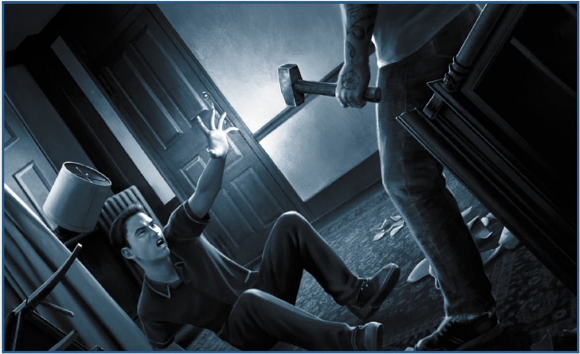

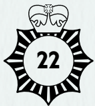

## 20

It's another 30 seconds before Mrs Fellaman seems satisfied that you are not there to lure her into an ambush. She returns to the doorway and gives you a suspicious stare.

' You're very quiet, aren't you? ' she says. ' What do you want? '

Look at the characteristics on your character sheet. You have Constitution (CON) 80. Write it down in the first space beside the characteristic name. When you make a CON roll, you will attempt to roll equal to 80 or lower.

In the second space beside the characteristic name, write down half of that value. In this case, write down 40. When you make a Hard CON roll, you will attempt to roll equal to 40 or lower.

To ask about the bruise on Mrs Fellaman's cheek, go to 50 . To look for anything that might facilitate illicit entry, go to 71 . To ask about the 'two boys', go to 76 . To insist on looking inside the house, go to 82 .

(3)

21

After  long  nights  attempting  to  push  over  empty  cans  of fizzy  drink  from  a  distance,  you  progressed  to  long  nights successfully  pushing  over  full  cans  of  fizzy  drink  from

a  distance.  Molly  was  not  pleased  about  the  sticky  floor, but you can achieve an effective cast of Impello every time, particularly if you are thirsty.

Note on your character sheet that you have Werelight and Impello as  mastered  spells.  You  do  this  by  marking  the  square  next  to the spell name.

You begin with a number of magic points equal to one-fifth of your Power (POW). So, if you have a POW of 70, you begin with 14 magic  points.  Each  spell  you  master  adds  an  additional  magic point, so add 2 magic points for mastering Werelight and Impello . Thus, you have a total of 16 magic points. Note down your total starting and current magic points in the spaces provided. For the moment, these numbers are both the same, but this will change as the adventure continues.

To cast a spell, you must spend magic points. It is exceptionally dangerous to spend more magic points than you have. Magic points regenerate on their own when you move from one scene to another.

Go to 41 .

(10)

## 22

You tell Mrs Fellaman that you are aware her flat is haunted, and you are a specialist who can help her to deal with the offending spectre.

She curls her lip. ' I don't want any help, ' she says.

You remind her that everybody is very concerned for her welfare and, if the disturbances continue, the neighbours will bring in the police; also, she has a finite supply of crockery.

This last point seems to strike home. ' I wouldn't want my Charles and Di wedding plate to get chipped, ' she says. ' All right. You'd better come in. '

Go to 10 .

(13)

## 23

You  step,  pivot,  and  twist  the  hammer  as  far  as  you  can. Knuckles gasps and drops it. You have the presence of mind to whip your foot out of the way as the hammer slams against the floorboards.

You have disarmed your opponent. Go to 39 .

(8)

## 24

You back up to the other side of the yard and try to see what is banging around behind the bins. Molly watches your heroics like a cat studies a mortally wounded pigeon.

The animal-if that is what it is-seems to have quietened down.

Make an Observation roll. Remember, roll 1D100 and attempt to get your Observation skill value or less.

Any time you make a skill or characteristic roll,  you  may  spend Luck  to  improve  that  roll.  So,  if  you  needed  40,  but  rolled  52, you can choose to spend 12 points of Luck to improve the roll and succeed. Of course, later in the adventure, you may wish you still had those Luck points!

If  you  do  spend  Luck,  don't  forget  to  update  your  current  Luck value on your character sheet.

If you succeed at the Observation roll, go to 47 . If you fail at the Observation roll, go to 53 .

(11)

## 25

' Funny  you  should  ask, '  she  says.  ' I've  seen  a  couple  of  shady characters  hanging  around  over  there. '  She  points  the  stylus across the road again. ' Not unusual for dealers to nip down the basement stairs  to  make  a  sale.  But  these  two  were  more  like… what would you call them… enforcers? The guys who break your leg to persuade you to pay up. '

Interesting. You cross the road.

Go to 107 .

(17)

## 26

You concentrate on pushing Knuckles in the chest. 'Impello!'

Spend 1 magic point. Make a Magic skill  roll.  Since  you  have mastered Impello , you may have a bonus die. This means you roll your tens die twice and take the best result. So, if you roll 92 and 22, you would use the 22.

If you succeed, go to 32 . If you fail, go to 56 .

(6)

## 27

You  tell  Mrs  Fellaman  you  are  aware  her  flat  is  haunted, and that you are a specialist who can help her deal with the offending spectre.

' It's none of your business, ' she says. ' Crock off, will you? ' The door slams in your face.

Ernie stares at you from the car window. He seems unimpressed.

If  you  have  not  already  tried  it,  you  may  go  around  the  back instead. Go to 33 .

If you are willing to risk upsetting Mrs Fellaman further, you may tap her window and conceal yourself in an attempt to draw her out. Go to 70 .

Otherwise, you must make a forced entry. Go to 104 .

(13)

## 28

You  struggle  to  block  the  hammer.  Knuckles  grits  his teeth and snarls.

You may spend Luck to reduce your roll enough to increase your level of success. So, if you needed 30 for a Hard success and you rolled 43, you would have to spend 13 points of Luck to succeed. If you do this, go to 8 .

If you do not wish to spend Luck, the character who is taking their action wins and the character who is responding loses.

So, if it is your action, you win. Go to 8 .

If it is Knuckles' action and you are responding, you lose. Go to 12 .

(4, 34)

## 29

You get a good look into the shadowy space behind the bins. It is a dark nest feathered with shredded packaging, and at its  heart  lurks  a  Yorkshire terrier. This is not Toby. This is some manner of grubby devil dog, with face markings not unlike the kind of cartoon masked burglars who used to walk around with huge sacks reading SWAG.

The dog notices you and emerges from its lair, growling deep in its throat.

Go to 77 .

(15)

## 30

Apple crumble has not tasted the same since you spent long nights with Nightingale, attempting to fix an apple atop a candlestick  while  he  swung  his  cricket  bat  at  it.  You  have developed some fluency with Scindere .

Note on your character sheet that you have Werelight and Scindere as  mastered  spells.  You  do  this  by  marking  the  square  next  to the spell name.

You  begin  with  a  number  of  magic  points  equal  to  one-fifth  of your  Power  (POW).  So,  if  you  have  a  POW  of  60,  you  begin with 12 magic points. Each spell you master adds an additional magic point, so add 2 magic points for mastering Werelight and Scindere . Thus, you have a total of 14 magic points. Note down your total starting and current magic points in the spaces provided. For the moment, these numbers are both the same, but this will change as the adventure continues.

To cast a spell, you must spend magic points. It is exceptionally dangerous to spend more magic points than you have. Magic points regenerate on their own when you move from one scene to another.

Go to 41 .

(10)

## 31

While Mrs Fellaman's back is turned, you take the opportunity to pop your head inside the door. You glimpse a mean little corridor which opens into a mean little living room/kitchen  combination.  There  are  no  obvious  signs of a struggle.

You  pull  back  just  as  Mrs  Fellaman  turns  around.  She gives you a suspicious look as she returns to the doorway.

Look  at  the  characteristics  on  your  character  sheet.  You  have Dexterity  (DEX)  80.  Write  it  down  in  the  first  space  beside the  characteristic  name.  When  you  make  a  DEX  roll,  you  will attempt to roll equal to 80 or lower.

In the second space beside the characteristic name, write down half of that value. In this case, write down 40. When you make a Hard DEX roll, you will attempt to roll equal to 40 or lower.

To ask about the bruise on Mrs Fellaman's cheek, go to 50 . To wait patiently for her to invite you in, go to 61 . To ask about the 'two boys,' go to 76 . To insist on looking inside the house, go to 82 .

## 32

Knuckles opens his eyes wide in surprise as he is shoved by an invisible hand. The hammer drops from his grasp.

Make a Power (POW) roll.  If  you  succeed, go to 37 ;  if  you  fail,  go  to 45 .

(26)

## 33

Accessing the rear of Mrs Fellaman's flat is not  straightforward. It is one in a row of private gardens protected by a brick wall, a serious knot of shrubbery, and a locked wooden gate stained a pleasing cherry red. You could deal with the lock, but the simplest thing might be to go over the wall.

You wait  for  the  street  to  clear  of  passers-by.  A  mother with a young child is the last straggler. As she bends to adjust something in her buggy, you swing your leg up and brace yourself on the wall.

Make an Athletics roll. Remember, you achieve a Regular success if you roll equal to the skill value or less, and you achieve a Hard success if you roll equal to half its value or less.

If you achieve a Hard success, go to 38 . If you achieve a Regular success, go to 44 . If you fail the roll, go to 49 .

(7, 27, 91)

## 34

Knuckles prowls the living room, watching your movements for  any  sign  of  weakness.  He  feints  with  the  business  end of his hammer.

Continue the combat. If Knuckles has just taken his action, it is now your action and vice versa. His Fighting skill is 40/20.

Decide whether you want to disarm your opponent or flee. If you have already refused an opportunity to flee, you must attempt to disarm. Whether it is his turn to act or respond, Knuckles tries to damage you.

Carry out an opposed Fighting roll. Knuckles makes a Fighting roll and gets a fail. Make a Fighting roll for yourself. Triple zero (100) is a fumble; 01 is a Critical success.

Compare the two results: Critical success  beats  Hard  success;  Hard success beats Regular success; Regular success beats fail; fail beats fumble.

If you win the opposed roll, go to 8 . If you lose the opposed roll, go to 12 . If it is a draw, go to 28 .

(12, 109)

## 35

You ask about the two boys Mrs Fellaman referred to. She gives the street one last look and then returns to the doorway.

' Toerags, '  she  says.  ' Claimed I owe them money. I've never seen  them  before  in  my  life.  If  they  come  back  I'll  give  them something they won't like. '

Door-to-door scams are still popular in the area, particularly those that target the elderly. But this particular lady does not seem taken in by them.

Look  at  the  characteristics  on  your  character  sheet.  You  have Intelligence  (INT)  80.  Write  it  down  in  the  first  space  beside the characteristic name. When you make an INT roll, you will attempt to roll equal to 80 or lower.

In the second space beside the characteristic name, write down half of that value. In this case, write down 40. When you make a Hard INT roll, you will attempt to roll equal to 40 or lower.

To ask about the bruise on Mrs Fellaman's cheek, go to 50 . To wait patiently for her to invite you in, go to 61 . To look for anything that might facilitate illicit entry, go to 71 . To insist on looking inside the house, go to 82 .

(3)

## 36

' Sure, ' she says. ' Guy on the second floor uses a super soaker on anybody  playing  grime  with  their  car  windows  open.  Passing beards get physical about sourdough recipes. Old geezer walks a chihuahua  that  feels  threatened  by  railings  and  footwear.  I  see all life here. '

You thank her for her diligence and cross the road.

Go to 107 .

(17)

## 37

Knuckles  flies  backwards  through  the  air.  His  leg  snags on an armchair and he flails, crashing to the ground head first. He stops moving. The hammer bumps on the carpet in front of you.

You turn to the second assailant.

Your successful POW roll increased the spell's effect. Go to 99 .

(32)

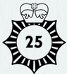

## 38

You  vault  the  wall  in  a  single,  clean  movement,  avoiding the foliage and landing catlike on the other side of the gate. After this Olympic-level performance, it is a simple matter to thread your way from garden to garden, counting the fences until you are level with the rear of Mrs Fellaman's flat.

Go to 65 .

(33)

## 39

Irate  at  the  loss  of  his  hammer,  Knuckles  advances,  fists raised. His boxing stance is informed more by trashy cinema than any commitment to the gym.

Knuckles  jabs  at  your  face.  If  he  has  already  taken  his action, it is now your action and vice versa. If the last thing you  did  was  cast  a  spell,  it  is  now  Knuckles'  action.  His Fighting skill is 40/20.

Decide whether you want to damage your opponent or restrain him. Now, carry out an opposed Fighting roll: make a Fighting roll  for  Knuckles,  then  one  for  yourself.  Triple  zero  (100)  is  a fumble; 01 is a Critical success.

Compare the two results: Critical success  beats  Hard  success;  Hard success beats Regular success; Regular success beats fail; fail beats fumble.

If the opposed roll is tied, you may spend Luck to reduce your roll enough to increase your level of success. So, if you needed 30 for a Regular success and you rolled 54, you would have to spend 24 points of Luck to succeed.

If you do not wish to spend Luck, the character who is taking their action wins and the character who is responding loses.

If you win  the opposed roll and  decided to  damage  your opponent, go to 54 .

If you win  the opposed roll and  decided to restrain your opponent, go to 59 .

If you lose the opposed roll, go to 48 .

(23, 45, 86)

## 40

A hairy  missile  with  teeth  launches  from  behind  the  bins. You throw yourself out of its path.

## 41

Mrs  Fellaman  emerges  from  the  kitchen  holding  a  whiteenamel camping mug and the kind of plastic cup that comes from the top of a Thermos flask. You sit down at the table. China  crunches  beneath  your  feet.  ' Sorry  I'm  out  of  real cups, ' she says.

Her teapot has somehow survived. As the tea brews she offers you a custard cream. You take one and ask about the ghost.

' He's my husband, ' she says, the edge of her mouth curling. ' Victor.  He  first  showed  up  three  months  ago.  Always  at  night. Same as he ever was. Quieter maybe.'

You lead the conversation slowly to the bruise on her cheek. She touches it as if she had forgotten it was there.

' We always used to row, you know, some people you just row with-I suppose even him being passed on couldn't change that. He made me so cross. I, uh... ' She looks sheepish. ' I forgot he was a ghost. I ran right through him, hit the wall, and fell over. You know how it is, you grab the nearest thing. That was the cupboard. It fell over, and then I had the Old Bill knocking at my door. '

Your custard cream is finished. You ask Mrs Fellaman to summon her husband for you.

' You're joking, ' she says. ' He  comes  and  goes  when  he wants-always did. '

You push back your chair, stand up, and open your palm.

You need a werelight to draw out the ghost. As there is no time pressure on you to cast the Werelight spell, there is no need to make a Magic roll to see if you are successful. Spend 1 magic point and write your new current magic point total in the space provided on your character sheet. Go to 51 .

(21, 30)

## 42

You tell  the  traffic  warden  you  are  a  social  worker  visiting a  family  across  the  road.  Her  expression  does  not  change. ' So, not delivering primary healthcare? ' she asks, stylus poised above her battered handheld computer.

You are a Social Worker with links to the Folly. Note down Social Worker  as  your  Occupation.  Raise  your  Observation,  Research, and Social skills from 30% to 60%. Write these numbers in the first space beside the skill names. You have the expert skill Magic at 60%. Write this in the space for expert skills. Choose one more common skill and raise it from 30% to 60%.

Make a Dexterity (DEX) roll.  As  usual,  you  may  spend  Luck to improve your roll. If you succeed, go to 58 ; if you fail, go to 68 .

You are also good at Languages. Decide on three specialisations and assign those as expert skills at 60%, 30%, and 30%. So, for instance, you might have Languages (Gujerati) 60%, Languages (Arabic) 30%, and Languages (Cantonese) 30%. Write these on your character sheet, too. Your starting skills are ready.

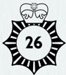

Finally, roll your ten-sided 'units' die twice (usually written as 2D10) and add the result to 50. This is your starting Luck. So, if you rolled 1 and 8, your result would be 1+8+50 = 59. Note down your starting  and  current  Luck  in  the  spaces  provided.  For  the moment, these numbers are both the same, but that may change as this adventure continues.

Go to 52 .

(1)

## 43

Knuckles is a little too slow this time. You catch his forearm and immobilise it.

If  you  already  had  Knuckles  restrained,  and  you  are  a  Police Officer, go to 105 .

If  you  already  had Knuckles restrained, and you are a Nurse or Social Worker, go to 84 .

Otherwise, continue the combat, but give Knuckles a penalty die for the remainder of the fight. This means that every time you roll for  Knuckles,  roll  your  tens  die  twice  and  take  the  worst  result. So, if the tens dice come up 40 and 60 and the units die comes up 9, you have rolled 49 and 69. The worst result is 69, so that's the one you use to determine whether Knuckles succeeds or fails at his Fighting roll.

You  may  attempt  a  further combat  manoeuvre  to  restrain Knuckles completely.

Go to 16 .

(67)

## 44

You  vault  the  wall,  but  your  foot  snags  on  a  shrub  and you topple down the far side of the gate. Your wrist bends back at impact.

If you are a Nurse, go to 55 . Otherwise, go to 60 .

(33)

## 45

Knuckles  stumbles  back,  collapsing  into  an  armchair.  His hammer  hits  the  carpet.  You  can  see  him  fail  to  process what just happened. He falls back on what he knows, getting back to his feet and closing for a fist fight. Still, you have successfully disarmed him.

Although  your  POW  roll  was  unsuccessful,  the  spell  still  had  a minor effect. Go to 39 .

(32)

## 46

You explain to Mrs Fellaman that you would like to come in to  talk  about  the  previous  night's  disturbance.  She  returns to the doorway.

' I've already spoke to the other copper, ' she says. By this she means  the  sergeant  whose  perceptive  report  led  to  your involvement. You try again to invite yourself into the house. Mrs Fellaman plants her feet and folds her arms.

Look at the characteristics on your character sheet. You have Power (POW) 80. Write it down in the first space beside the characteristic name. When you make a POW roll, you will attempt to roll equal to 80 or lower.

In the second space beside the characteristic name, write down half of that value. In this case, write down 40. When you make a Hard POW roll, you will attempt to roll equal to 40 or lower.

To ask about the bruise on Mrs Fellaman's cheek, go to 50 . To wait patiently for her to invite you in, go to 61 . To look for anything that might facilitate illicit entry, go to 71 . To ask about the 'two boys,' go to 76 .

(3)

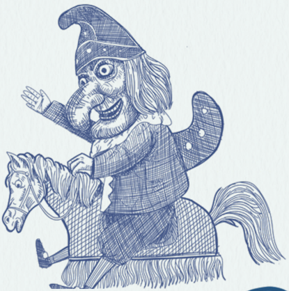

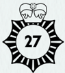

47

From this distance you see little movement behind the bins. Something rustles quietly in the shadows, but it could easily be the wrapping from a Marks &amp; Spencer vegetable biryani.

Then you glimpse it out of the corner of your eye, moving fast and low against the ground. It passes beneath a window and you recognise that the bin fiend is a dog. But not Toby. This is a scrappy Yorkshire terrier, with the kind of face that Cerberus might pull upon learning he has been resurrected in miniature with only one head.

Go to 77 .

(24)

## 48

Knuckles throws a torrent of punches. You are knocked back against the table.

Mark down that you take 1 damage. If you have suffered 1 damage in total, you are Hurt. If you have suffered 2 damage in total, you are Bloodied. If either of these, go to 67 .

If you have suffered 3 damage in total, you are Down. Go to 95 .

(39)

## 49

With a brave effort, you get up on the wall, but you misjudge the height of the gate. Your supporting foot snags on a branch and you tumble, landing on your back on the pavement.

A  teenage  boy  in  a  Tottenham  Hotspur  strip  (jersey) rounds the corner, dribbling a football (soccer ball). Seeing you  sprawled  there,  he  pauses.  Then  he  bounces  his  ball off  the  gate  and  dodges  around  your  head,  beating  an imaginary defender.

You get to your feet. A neighbour peers from their kitchen window to see what all the noise is.

If you have not already tried it, you may return to the front door and knock firmly. Go to 13 .

Otherwise, you must make a forced entry. Go to 104 .

( 33 )

## 50

Mrs Fellaman turns her head away as you ask about the bruise. She very deliberately does not lift her hand to her cheek.

' I walked into the door, didn't I? ' she says. ' You get like that when you're a bit older. '

You find a gentle way to say that neither of you believes that. She does not relent. But she doesn't argue with you either.

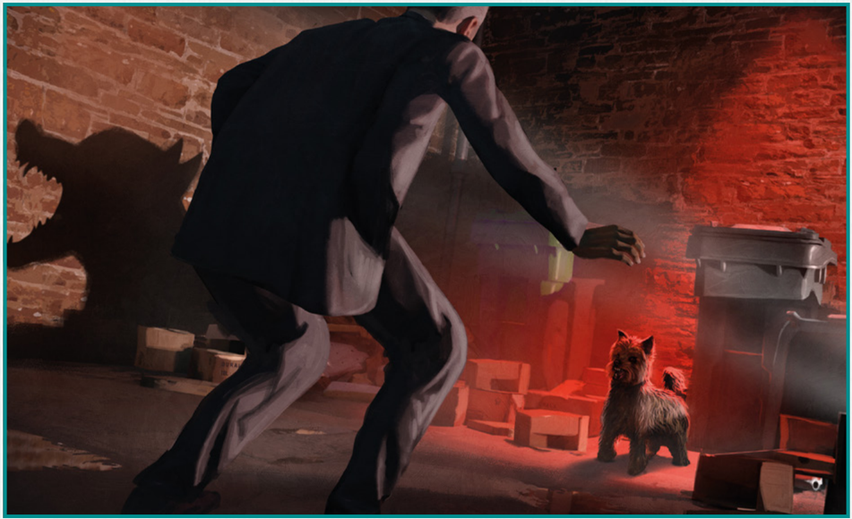

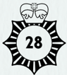

You have Strength (STR) 60. Write that, and its half value of 30, beside the characteristic name.

Your skills also use half values for Hard skill rolls. Fill those in now. So, if your Fighting skill has a value of 30%, then its half value is 15%, written in this adventure as 30/15.

Go to 88 .

(20, 31, 35, 46)

## 51

A small  and  very  bright  sphere  appears  in  your  hand,  the size of a golf ball. From experience, you know its energy is irresistible  to  ghosts.  You  place  the  werelight  on  the  table. Mrs Fellaman stares at it wide-eyed. ' What's that? ' she asks.

Before you can answer, the ball of light darkens to a dim crimson. A ghost is feeding on its energy. You look around.

A man stands against the side wall, looking at you with apparent amazement. He is young, early 20s, wearing a rather nice suit. He looks like he could feature on the Wikipedia page which defines the Mod subculture.

You raise an eyebrow at Mrs Fellaman.

' What? ' she says. ' He looks just like he did when I met him. '

You look ghost-Victor over from head to toe. Your gaze stops on his shoes. They're old, worn, brown; too big for his feet. Clumpy. No self-respecting Mod would wear those shoes.

To ask the ghost about Mrs Fellaman, go to 63 . To ask the ghost why he is here, go to 93 . To shut down the werelight, go to 101 .

(41)

## 52

You explain that this is a preliminary visit to a new client. The warden points her stylus at a small notice on a pole across the road. ' Permit holders only until 11 pm, ' she says. ' Do you have a permit for zone CA-F? '

You are going to make a Luck roll. Roll two ten-sided dice again. This  time,  use  both  your  'tens'  and  your  'units'  dice.  This  will give you a number between 01 and 100. So, if the tens die comes up 50, and the units die comes up 3, you have rolled 53. A triple zero means 100.

This  is  known  as  rolling  1D100  and  is  the  most  common roll in RoL:RPG play.  Compare  what  you  rolled  to  your current Luck value.

If you rolled higher than your current Luck value, you failed at the Luck roll. Go to 66 .

(42)

## 53

You keep your eye on the dark recess behind the bins. Things seem  to  have  quietened  down.  A  shadow  flops,  the  torn remains of a box catching an air current. Where is the creature that was enacting such loud violence a few seconds ago?

A hairy missile with teeth erupts from the ground beside you. You throw yourself out of its path.

Make  a  Hard Dexterity (DEX) roll.  Remember,  on  a  Hard challenge you need to roll equal to half of your DEX value or less. As usual, you may spend Luck to improve your roll.

If you succeed, go to 58 ; if you fail, go to 68 .

(24)

## 54

Your fist catches Knuckles on the ear. He yowls and cups a hand over it.

Mark down on some scrap paper that you have inflicted 1 damage to Knuckles. If you have inflicted 3 or more damage in total, your opponent drops to the ground. Go to 99 . Otherwise, go to 67 .

(39)

## 55

You  have  seen  this  injury  hundreds  of  times-a  reflexive thrust of the hand to break a fall. At its worst, it results in a broken collarbone, but you have a simple wrist sprain. Only rest will fix it permanently, but you can make do for now with one of the bandages you keep about your person.

Nobody from the corner flat comes out to investigate while you sit in their garden applying the bandage for compression. You flex your fingers. This will be all right until you get home.

Favouring  your  other  hand,  you  work  from  garden  to garden,  counting  the  fences  until  you  are  level  with  Mrs Fellaman's flat.

Go to 65 .

If you rolled equal to your current Luck value or less, you succeeded at the Luck roll. Go to 57 .

(44)

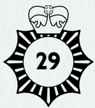

## 56

Under  pressure,  you  sometimes  find  it  hard  to  shape  the forma .  The  hammer  arcing  towards  your  head  represents  a significant amount of pressure. This time, the spell eludes you.

You must deal with your attacker, hand-to-hand. Go to 4 .

(26)

## 57

You  are  forced  to  concede  that  you  do  not  possess  the appropriate permit. Yet the warden hesitates.

' Wait a minute. Social  worker?  What's  that  like?  My  sister's looking for a job. '

You explain that the role is one of support and problemsolving,  rooted  in  social  and  interpersonal  difficulties.  It requires  careful  record-keeping  and  liaison  with  a  wide range  of  other  services  and  agencies,  under  pressure  from shrinking budgets. At heart, the work aims for a more equal and just society.

' Oh  right.  Forget  it  then.  She's  pretty  social,  but  not  much of  a  worker, if you know what I mean. '  The warden looks in both  directions.  ' I'll  miss  you  this  time,  love,  OK?  Don't  be here in an hour. '

She walks off. You cross the road.

Go to 107 .

(52)

## 58

You duck and roll across the yard, while the snarling ball of grubby trouble soars through the space you recently occupied. As  you  rise,  you  recognise  your  assailant  as  a  Yorkshire terrier-with  a  stare  that  would  be  at  home  in  any  postapocalyptic thriller.

You face up to the beast.

Go to 77 .

(40, 53)

## 59

You sidestep Knuckles' punch and get a lock on his arm. You try to force him to the ground. He continues to lash out at your legs and stomach.

Knuckles, roll your tens die twice and take the worst result. So, if the tens dice come up 30 and 70 and the units die comes up 8, you have rolled 38 and 78. The worst result is 78, so that's the one you have to use to determine whether Knuckles succeeds or fails at his Fighting roll.

You  may  attempt  a  further combat  manoeuvre  to  restrain Knuckles completely.

Go to 67 .

(39)

## 60

You flex your injured hand and grimace at the surge of pain. You should probably apply ice to stop it swelling, but none is available while you squat here on the paving of a stranger's back garden. The sooner you can deal with this situation, the sooner you can get the injury looked at.

You press on from garden to garden, counting the fences until you are level with Mrs Fellaman's flat.

Until you leave Prince of Wales Road, you must add a penalty die to your Fighting rolls. This means that every time you make a Fighting roll, roll your tens die twice and take the worst result. So, if the tens dice come up 40 and 60 and the units die comes up 1, you have rolled 41 and 61. The worst result is 61, so that's the one you have to use to determine whether you succeed or fail at your Fighting roll.

Go to 65 .

(44)

## 61

You  glance  at  the  neighbouring  properties  in  the  manner of  one  who  is  concerned  about  confidentiality.  The  silence stretches out.

Mrs  Fellaman  gives  you  the  kind  of  stare  perfected  by those  with  a  preference  for  marmalade  sandwiches.  She shows no inclination whatsoever to relocate the conversation.

You have Constitution (CON) 60. Write that, and its half value of 30, beside the characteristic name.

Your skills also use half values for Hard skill rolls. Fill those in now. So, if your Stealth skill has a value of 60%, then its half value is 30%, written in this adventure as 60/30.

Go to 88 .

Continue  the  combat,  but  give  Knuckles  a  penalty  die  for  the remainder of  the  fight.  This  means  that  every  time  you  roll  for

(14, 31, 35, 46)

## 62

Knuckles is wary of you now. The two of you crash around the living room, trading punches while crockery crunches beneath your feet. His heel snags on the fireplace and you take the opportunity to seize Mrs Fellaman's carriage clock and smash him over the head.

Mark  down  on  some  scrap  paper  that  you  inflict  1  damage  to Knuckles. If you have inflicted 3 or more damage in total, your opponent drops to the ground. Go to 99 . Otherwise, go to 16 .

(67)

## 63

The  man  at  the  wall  hesitates.  He  doesn't  answer  your questions about Mrs Fellaman. ' What do you want? ' he asks.

Something  is  wrong  with  his  accent  too.  It  is  not  the kind of '60s cockney twang that would fit with the suit and Eugenia Fellaman. You glance at the werelight. While the conversation continues, you are feeding magic to this ghost.

To ask the ghost why he is here, go to 93 . To shut down the werelight, go to 101 .

(51)

## 64

Knuckles flees to the window and turns his back to clamber out. You vault over the settee and reach him in time to slam his head against the frame.

Mark  down  on  some  scrap  paper  that  you  inflict  1  damage  to Knuckles. If you have inflicted 3 or more damage in total, your opponent drops to the ground. Go to 99 . Otherwise, go to 103 .

(16)

## 65

The  flat  has  a  small  rear  garden  which  looks  like  it  was tended with care until recently. You try the kitchen door. It is unlocked. You announce your presence and step inside the flat.

Mrs Fellaman appears in the doorway to the living room. She looks defeated.

' Can't  take  a  hint,  can  you? '  she  says.  ' Well,  I  suppose  you better come in. '

Go to 10 .

(38, 55, 60)

## 66

You  are  forced  to  concede  that  you  do  not  possess  the appropriate  permit.  The  traffic  warden  taps  her  teeth  with the council-issued stylus and checks her watch.

Defeated, you return to the car and ease it out of the space. After  20  minutes  of  circling,  you  find  an  incredibly  tight space three streets away. Local kids sitting on a wall eye the Escort's removable components. Judging by their expressions of disgust, you have nothing to fear.

You make your way on foot back to the address on Prince of Wales Road.

Go to 107 .

(52)

## 67

Knuckles  spits, breathing hard. You  are not the easy victim he expected.

Continue  the  combat.  If  your  opponent  was  the  last  person  to take their action, it is now your turn and vice versa. Knuckles' Fighting skill is 40/20.

On your turn, decide whether you want to damage your opponent or restrain him.

On his turn, Knuckles tries to damage you.

Carry  out  an  opposed Fighting roll:  make  a  Fighting  roll  for Knuckles, and then one for yourself. Triple zero (100) is a fumble; 01 is a Critical success.

Compare the two results: Critical success  beats  Hard  success;  Hard success beats Regular success; Regular success beats fail; fail beats fumble.

Remember, if the opposed roll is tied, you may spend Luck to reduce your roll enough to increase your level of success. So, if you needed 45  for  a  Regular  success  and  you  rolled  56,  you  would  have  to spend 11 points of Luck to succeed.

If you do not wish to spend Luck, the character who is taking their action wins and the character who is responding loses.

If you win  the opposed roll and  decided to restrain your opponent, go to 43 .

If you win  the opposed roll and  decided to  damage  your opponent, go to 62 .

If you lose the opposed roll go to 89 .

(48, 54, 59)

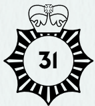

## 68

You don't move fast enough. As its limbs splay in mid-air, you identify a Yorkshire terrier, with a face constructed from a shaggy nightmare. It clips your ribs and knocks you spinning.

Pain flares up your leg as you get to your feet.

You  were  knocked  prone  by  the  dog's  attack.  This  leaves  you particularly vulnerable to further attacks. However, when it is your turn to act, you may stand up as a free action.

Go to 77 .

( 40 , 53 )

## 69

You concentrate on fixing the hammer in space. 'Scindere!'

Spend 1 magic point. If you want to boost the spell  for  greater effect, spend 1 additional magic point. Update your current magic points accordingly.

Make a Magic skill roll. Since you have mastered Scindere , you may have a bonus die. This means you roll your tens die twice and take the best result. So, if you roll 36 and 16, you would use the 16. If you succeed, go to 75 ; if you fail, go to 97 .

(6)

## 70

This may not be the most professional move of your career. However, it might put some distance between the householder and whatever has manifested inside her residence. Looking around for a hiding place, you consider the steps above her door, which lead to the flats above. You would be in plain sight, but only if Mrs Fellaman looks directly up. Worth a try.

From inside, you hear another plate smash. You rap on the window then flee up the stairs. You have barely reached your refuge  when  Mrs  Fellaman  bursts  from  the  door,  moving faster than you expected. She appears to have a cricket bat.

Go to 74 .

(7, 27)

## 71

There is a hook on the wall behind Mrs Fellaman, upon which hangs a ring with two Yale keys. The letterbox has no brushes. An enterprising burglar with a long, hooked stick and a steady hand might enter with minimal force-or a magically-skilled investigator looking for a conventional solution.

She follows your gaze over her shoulder and down the back of the door. ' What? ' she asks.

You have Dexterity (DEX) 60. Write that, and its half value of 30, beside the characteristic name.

Your skills also use half values for Hard skill rolls. Fill those in now. So, if your Read Person skill has a value of 60%, then its half value is 30%, or 60/30.

Go to 88 .

(14, 20, 35, 46)

## 72

You tell the traffic warden you are a nurse attending a new patient across the road. The warden points her stylus at your rear-view mirror. ' You're not displaying the Health Emergency Badge, ' she says.

You are a Nurse with links to the Folly. Note down Nurse as your Occupation.  You  have  the  expert  skills  Medicine  at  60%  and Magic at 60%. Write these skills and their starting values down in the space for expert skills on your character sheet. Raise your Observation, Read Person, and Social skills from 30% to 60%. You may choose one more common skill and raise that from 30% to 60%. Your starting skills are ready.

Finally, roll your ten-sided 'units' die twice (usually written as 2D10) and add the result to 50. This is your starting Luck. So, if you rolled 8 and 7, your result would be 8+7+50 = 65. Note down your starting  and  current  Luck  in  the  spaces  provided.  For  the moment, these numbers are both the same, but that may change as this adventure continues.

Go to 81 .

(1)

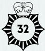

## 73

You put an armchair between yourself and Knuckles, bolt for the door, and throw it open. You scramble out onto Prince of  Wales Road, where the sounds of struggle have already attracted a few passers-by. One is on their phone, presumably to the emergency services.

You are still an apprentice in the ways of magic, and you have successfully escaped a dangerous situation. You can call in reinforcements. But this will not go down as a glorious day in your career with the Folly.

Mrs  Fellaman's  voice  splits  the  air,  screaming  at  the intruders.  From  the  thump  of  wood  against  flesh  and  the whining of low-level toughs, she is giving as good as she gets.

You have failed to get to the bottom of what's happening at Prince of Wales Road. Don't worry if things didn't turn out for the bestyou can always return to the beginning and try again, perhaps choosing a different occupation. Good luck! THE END.

(109)

## 74

Mrs  Fellaman  steps  up  to  the  pavement,  brandishing  her willow-and-linseed-oil  weapon  with  serious  intent.  ' I  told you boys I'm not paying! ' she yells, scanning in both directions. A passing cyclist swerves, narrowly missing the Escort.

She notices Ernie and steps closer to the car, eyeing the hairy  terror.  For  a  moment  you  visualise  the  paperwork that  will  result  if  the  pensioner  you  were  supposed  to  be protecting initiated an armed brawl with a stray dog you had acquired. Then she turns around and spots you on the stairs. Her jaw sets.

If you are a Social Worker, go to 79 .

Otherwise,  make  a Social skill  roll.  Remember,  you  achieve  a Regular success if you roll equal to the skill value or less, and you achieve a Hard success if you roll equal to its half value or less. If you  achieve  a  Hard  success,  go  to 83 .  If  you  achieve  a  Regular success, go to 87 . If you fail the roll, go to 91 .

(70)

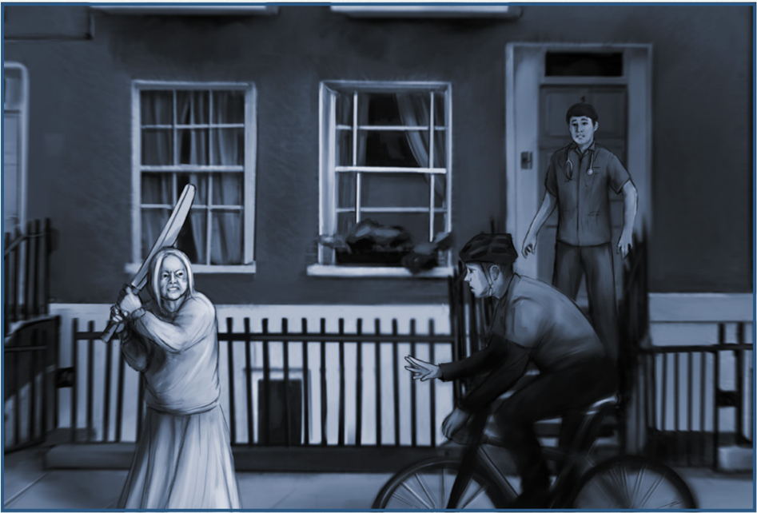

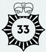

## 75

Confusion  breaks  across  Knuckles'  face  as  the  spell  takes hold and the hammer locks into place in the air.

If you boosted the spell, go to 80 . Otherwise, go to 86 .

(69)

## 76

You ask about the two boys Mrs Fellaman referred to earlier. She wrinkles her nose.

' Toerags, '  she  says.  ' Claimed I owe them money. I've never seen  them  before  in  my  life.  If  they  come  back,  I'll  give  them something they won't like. '

Door-to-door scams are still popular in the area, particularly those that target the elderly. But this particular lady does not seem susceptible to social engineering.

You have Intelligence (INT) 60. Write that, and its half value of 30, beside the characteristic name.

Your skills also use half values for Hard skill rolls. Fill those in now. So, if your Social skill has a value of 60%, then its half value is 30%, or 60/30.

Go to 88 .

(14, 20, 31, 46)

## 77

As  you  confront  the  terrier,  you  experience  three  rapid insights. First, a nametag glints beneath the grimy leather of its collar. Second, a dog that is drawn to the Folly probably has  some  innate  magic  sensitivity.  Third,  it  has  noticed your packet of artisan sausages and its eyes are fixed on the gleaming plastic wrap. You pull open the packet and extract a sausage for the hungry dog.

You could make an Animal Handling roll to subdue the Yorkshire terrier-but you do not possess this expert skill. You may instead Try Your Luck, by spending 10 Luck points to attempt an Animal Handling roll, but this will be a Hard roll on your Intelligence (INT) or Power (POW), whichever is highest. If you succeed, you can choose to spend a further 10 points of Luck to permanently acquire the Animal Handling skill.

If you want to Try Your Luck, go to 85 . If you prefer not to spend your Luck in this situation, go to 98 .

(29, 47, 58, 68)

## 78

Your legs buckle and you fall into nothingness.

When your vision returns, you are staring at the light in the centre of Mrs Fellaman's ceiling. Your head pounds. Her face looms into view, creating an impromptu eclipse.

' When you got mashed by that hammer, I thought you were a goner, ' Mrs Fellaman says. ' Get off my carpet so I can sweep up. ' She offers you a wiry hand.

Your attackers appear to have left.

Because you were Down at the end of the fight, you remain Hurt for  the  rest  of  the  day.  Erase  the  marks  from  the  Down  and Bloodied boxes on your character sheet.

Go to 110 .

(12)

## 79

This is not the first time you have faced down an irate senior citizen  wielding  a  cricket  bat.  You  are  able  to  push  aside immediate  worries  about  head  injuries  and  concussion  in order to take a professional approach.

Go to 83 .

( 74 )

## 80

Your  onrushing  attacker  runs  straight  into  the  masonry hammer, literally hitting himself in the face. He goes down like a coyote in a cartoon.

You turn to the second assailant.

Go to 99 .

( 75 , 103 )

## 81

The Ford Escort you are using on this occasion does not have the stock of blank badges you use on NHS (National Health Service) business. You go through your pockets for a spare.

The  warden  watches  you  search.  ' It  needs  to  display  the address or it's not valid, ' she comments unnecessarily.

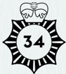

You are going to make a Luck roll. Roll two ten-sided dice again. This time, use both your 'tens' and your 'units' dice. This will give you a number between 01 and 100. So, if the tens die comes up 00, and the units die comes up 4, you have rolled 4-this is known as rolling 1D100 and is the most common roll in RoL:RPG play. A triple zero means 100.

Compare what you rolled to your current Luck value.

If you rolled equal to your current Luck value or less, you succeeded at the Luck roll. Go to 90 .

If you rolled higher than your current Luck value, you failed at the Luck roll. Go to 94 .

(72)

## 82

You insist to Mrs Fellaman that you would like to come in and talk about the previous night's disturbance. She remains in the doorway.

' I've already spoke to the other copper, ' she says. By this she means  the  sergeant  whose  perceptive  report  led  to  your involvement. You try again to invite yourself into the house. Mrs Fellaman plants her feet and folds her arms.

You have Power (POW) 60. Write that, and its half value of 30, beside the characteristic name.

Your skills also use half values for Hard skill rolls. Fill those in now. So, if your Athletics skill has a value of 30%, then its half value is 15%, written in this adventure as 30/15.

Go to 88 .

(14, 20, 31, 35)

## 83

Using  your  conflict  resolution  training,  you  frame  your actions  as  extracting  Mrs  Fellaman  from  a  hazardous situation. You explain that your presence, however she might resent it, represents the support of her community, and that her nightly quarrels with a ghost are unsustainable both in terms of disturbing the neighbours and her personal health.

The fight seems to go out of Mrs Fellaman. She leans on the cricket bat and touches her bruised face.

' I know that, ' she says. ' I just didn't want it to end yet. ' She gives a long sigh. ' I suppose you'd better come in. '

Go to 10 .

(74, 79)

## 84

You kick Knuckles' ankles from beneath him, and his face hits the floor. He continues to wriggle like a fish out of water until  Mrs  Fellaman  pushes  past  you  and  administers  the coup de grace to his head with her cricket bat. The resulting 'whack'  would  be  familiar  to  any  spectator  at  The  Oval cricket ground.

Knuckles is Down. The second intruder is long gone. Go to 110 .

(43)

## 85

You display the sausage and hold up a finger to indicate the terrier should behave. Your finger looks uncomfortably like a second sausage.

Subtract 10 points from your current Luck.

You will use your Intelligence (INT) or Power  (POW) characteristic (whichever is highest) to attempt Animal Handling, even though you don't possess this expert skill. Try Your Luck by making a Hard roll against INT or POW (whichever is highest). As usual, you may spend additional Luck to improve your roll.

If you succeed at the roll, go to 92 . If you fail at the roll, go to 98 .

(77)

## 86

Knuckles hauls at the hammer, unable to comprehend the force holding it frozen in space. He gives it a few more pulls before turning to face you.

You have successfully disarmed your opponent. Go to 39 .

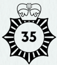

## 87

You try to reassure Mrs Fellaman that you have only her best interests at heart. She swings the bat at you, but you can see her rage-and the strength behind each blow-dissipating.

To dodge the cricket bat, make a Fighting roll. As Mrs Fellaman is conflicted about the fight, you may apply a bonus die to your roll. This means you roll your tens die twice and take the best result. So, if you roll 71 and 41, you would use the 41.

If you succeed, go to 96 ; if you fail, go to 100 .

(74)

## 88

' I've got a pot on the stove, ' Mrs Fellaman says.

You tell her that everybody is concerned about her safety. ' That's  nice, '  she  says.  ' But  it's  my  patience  you  should  be worried about. That other copper looked all over the house, and she found nothing. Haven't you got anything better to do than harass an old age pensioner? '

You  adopt  a  particularly  patient  tone  while  explaining you're there to help.

' I'm sick of your help, '  she says. ' Have you got a warrant or council notice or something? '

You admit that you have not.

' Then you can piss off, ' she says and closes the door in your face.

Allocate the following numbers to your remaining three characteristics: 50, 50, 40.

Your movement rate (MOV)  is 8.

Go to 102 .

(50, 61, 71, 76, 82)

## 89

Knuckles  closes  in,  shrugging  off  your  blows  to  land  a heavy  punch  against  your  stomach.  You  feel  the  breath rush out of you.

Mark down that you take 1 damage. If you have suffered 1 damage in total, you are Hurt. If you have suffered 2 damage in total, you are Bloodied. Mark the appropriate boxes on your character sheet and go to 16 .

If you have suffered 3 damage in total, you are Down. Mark the Down box on your character sheet and go to 95 .

( 67 )

## 90

You  find  an  old  Health  Emergency  Badge  in  your  jacket pocket.  It  is  creased,  dog-eared,  and  features  a  ring  from a  coffee  mug  across  one  corner,  which  is  presumably  why you  never  used  it.  You  lean  on  the  roof  of  the  Escort  to inscribe the address of your new client in painstakingly clear capital letters.

The warden makes a point of lingering until you hang the HEB from the mirror of the Escort. Clinging to this token victory, she moves off.

You cross the road.

Go to 107.

( 81 )

## 91

Your  attempts  to  calm  Mrs  Fellaman  down  only  seem  to increase her fury, and she steps towards you with her cricket bat raised. You have no alternative but to get out of the way.

If you have not already tried it, you may retreat and go around the back instead. Go to 33 .

Otherwise, you must make a forced entry. Go to 104 .

( 74 )

## 92

The terrier's attitude improves significantly once it realises it can obtain a sausage for good behaviour. After a bit of initial skittering around and snarling, it sits up and waits, trembling as it eyes the meaty reward.

Three hard-earned sausages later, the dog is calm and compliant.

To permanently gain the Animal Handling expert skill at half the appropriate skill value (either INT or POW, depending on which one you used to make the skill roll), spend a further 10 points of Luck and then write the skill name, along with its full and half values, on your character sheet.

Go to 106 .

(85)

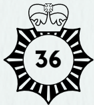

## 93

The  man's  eyes  flicker  to  the  werelight  and  then  to  Mrs Fellaman. He doesn't answer.

You have fed him enough magic. Time to wind this up.

Go to 101 .

(51, 63)

## 94

You  complete  your  search  and  admit  you  do  not  have  a Health Emergency Badge to display. You show the warden your NHS identification card instead and appeal to her good nature. She taps her teeth with the council-issued stylus and checks her watch.

Defeated,  you  return  to  the  car  and  ease  it  out  of  the space. After 20 minutes of circling, you find a space behind a  gardener's  lorry  three  streets  away.  Before  you  can  shut off  the  air  conditioning,  the  car  fills  with  the  pungent stench of compost.

You make your way on foot back to the address on Prince of Wales Road.

Go to 107 .

(81)

## 95

Knuckles grabs your collar and, spittle flying, headbutts you in the face. Everything goes dark.

When you rise back to consciousness, something is lying on your face. You reach for it and find it to be the shaft of a standard lamp. The shade has been smashed. As you roll it aside, Mrs Fellaman drifts into view.

' I liked that lamp, ' she says. ' Got it from Harrods. '

She picks up the lamp without offering you any assistance. The attackers appear to have left.

Because you were Down at the end of the fight, you remain Hurt for  the  rest  of  the  day.  Erase  the  marks  from  the  Down  and Bloodied boxes on your character sheet.

Go to 110 .

(48, 89)

## 96

You  duck  under  the  last  swing  of  the  bat.  Mrs  Fellaman suddenly seems to feel its weight and lets it rest on the step beneath you. She slumps against the railing.

You  relieve  her  of  the  weighty  bat  and  insist  that  you should enter the flat to assess the situation.

' I just got my blood up, ' she says. ' Sorry about trying to clobber you and all that. '

You return to the flat together.

Go to 10 .

( 87 )

## 97

Under  pressure,  you  sometimes  find  it  hard  to  shape  the forma .  The  hammer  arcing  towards  your  head  represents  a significant amount of pressure. This time, the spell eludes you.

You must deal with your attacker, hand-to-hand. Go to 4 .

(69)

## 98

The  terrier's  response  is  swift  and  overwhelming.  As  it charges,  you  whip  the  sausage  out  of  reach-but  it  is  not aiming for your paltry single sausage. Its jaws clamp around the entire bag of sausages and its weight drags you off balance. You stumble and your head crashes against the wall. As you thump to the ground, the bag gives way and artisan sausages spill across the yard.

After  30  seconds  of  deep  breathing  and  cold  personal reflection  to  a  soundtrack  of  tearing  plastic  and  meaty guzzling,  you  sit  up.  Most  of  the  sausages  are  gone.  The dog, however, is calmer. It sniffs and watches you mop blood from your temple.

You are Hurt: in pain, but able to carry on. Mark that you are Hurt on your character sheet. Your performance is not affected yet, but subsequent injuries could change that.

You will recover (erasing the mark for Hurt) when you leave the Folly and move to the next scene in the story. Go to 106 .

(77, 85)

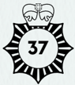

99

You turn to see Mrs Fellaman swing a cricket bat into the face of the second invader. He drops like wet laundry. She studies him for a moment before delivering a single, considered kick to his groin.

' Get out of it, ' she says. ' You'll get your money when I've got it. ' He stumbles to the rear window and topples out into the night.  You  hear  creaks  and  moans  as  he  retraces  his  path through strangers' gardens.

Mrs Fellaman looks up at you. ' My fault, ' she says. ' I get a little frisky sometimes on the gee-gees. I'm none too particular who I take a loan from. '

You'll  have  to  decide  what  to  do  with  Knuckles,  who  is currently groaning on the carpet. But that can wait for later.

Go to 110 .

(37, 54, 62, 64, 80, 105)

100

The cricket bat connects with your shoulder and slams you against  the  railing.  Mrs  Fellaman,  at  least,  has  the  good manners to be appalled at what she has done. You take the bat from her hands and reassure her that no bones are broken.

' I just got my blood up, ' she says. ' Sorry about that. It wasn't really you I was mad at. I suppose you had better come in. '

You return to the flat together.

You have suffered 1 damage and are Hurt. There is a box to mark this on your character sheet. However, because the combat has ended, you immediately recover from your Hurt state. If Mrs Fellaman had hit you again, the consequences would have been more significant.

Go to 10 .

(87)

101

You ask the ghost what his mother's name is. He frowns and hesitates. ' What do you want to know for? ' he says.

The  hesitation  tells  you  enough.  You  extinguish  the werelight  and  'Victor'  instantly  fades  to  transparency.  A whisper tickles the air. ' Martha. '

' Bring him back, ' Mrs Fellaman says.

You ask her if Victor's mother was named Martha. ' No. ' She looks sour. ' But he's dead. You're bound to forget-' The back window shatters.

Go to 6 .

(51, 63, 93)

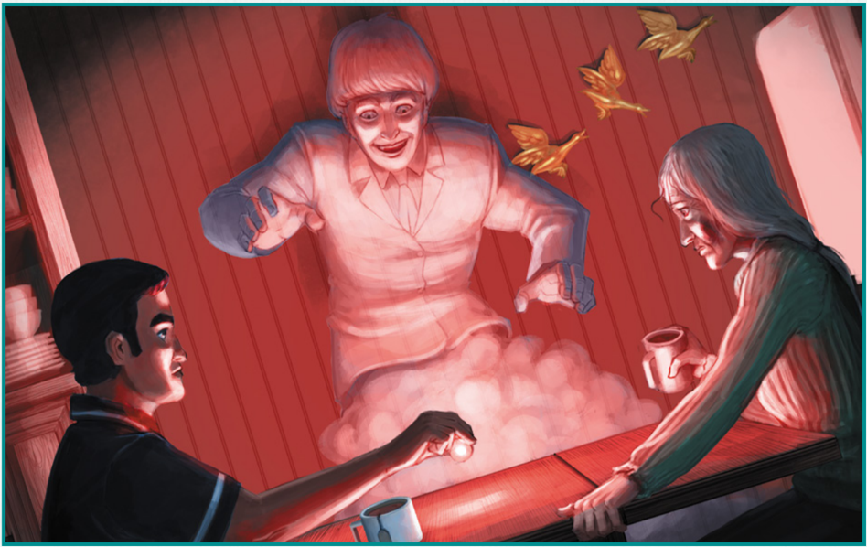

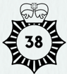

## 102

You return to the Ford Escort and settle behind the wheel to consider your options. After a minute, you unfold the report for another look.

The  Camden  response  team  passed  the  details  onto  the local  neighbourhood  safety  team,  which  is  headed  by  a Sergeant Sutherland. You put a call into the local station and get her on the phone. Once you get past the initial wariness that  most  police  have  for  agents  of  the  Folly,  she  relaxes and opens up.

' I  talked  to  the  neighbours,  confirmed  their  stories,  made  a follow-up visit to Mrs Fellaman, and found precisely nothing. And, since all I had on that night was leftover pasta bake, I parked my own car outside and waited until I heard the argument for myself. '

The  sergeant's  notes  specify  hearing  two  voices.  But when Sutherland talked herself inside the flat, Mrs Fellaman was alone.

' That's  right, '  she  says.  ' And I'll  tell  you,  something  was  off about that flat. '

Members  of  the  general  public  are  regularly  unsettled by inconsequential tosh. But Sergeant Sutherland's 30 years of experience in policing are as good a barometer for supernatural activity as you are likely to find.

' Your kind of weird bollocks, ' she says.

Before  you  can  take  any  further  action  on  this  case,  such  as  an unauthorised  entry  to  Mrs  Fellaman's  flat,  you  need  to  be  sure that there is indeed some 'weird bollocks' going on.

Go to 5 .

(88)

## 103

Knuckles dives through the open window. His compatriot seems long gone. You get to the window. Shrubs bend and fencing  creaks.  Groans  punctuate  his  journey  through  the gardens of Prince of Wales Road.

Mrs Fellaman comes up behind you, leaning on her cricket bat.  ' Let him go, '  she  says.  ' I  already  sent  his  friend  packing. And I do owe them the money. A couple of sure things at the races that didn't come in. '

Go to 110 .

(16)

## 104

Walking  away  from  a  ghostly  manifestation  in  progress is  not  an  option,  and  you  seem  to  have  exhausted  all  of your  alternatives  except  one.  You  examine  Mrs  Fellaman's door and the Yale lock that secures it. A more experienced magician could simply carve out the cylinder, but you will have to do it the old-fashioned way.

You get a run-up as best you can and shoulder the door. It  flies  open  with  a  crack,  admitting  you  into  the  flat's narrow hallway.

As you turn to survey the interior, a strange disc tumbles through the air. By the time you recognise it as a dinner plate with decorative bird illustrations, it is dangerously close to your face. You duck.

Make a Fighting roll.  If  you  fail,  suffer  1  damage  and  become Hurt. Mark this on your character sheet. Although painful, it does not otherwise affect your performance.

Go to 108 .

(27, 49, 91)

## 105

You kick Knuckles' ankles from beneath him, and his face hits the floor. Before he can wriggle out of it, you put a knee on his back and sling one cuff around his right wrist. A twist of the forearm brings the other wrist close enough to fasten the second cuff.

Now to deal with the second assailant.

Go to 99 .

(43)

## 106

The dog does not resist as you crouch down and lift the brass tag on its collar. The tag is shaped like a cartoon bone and engraved with tight capital letters reading ERNIE. Satiated on sausages, Ernie seems more curious than aggressive.

You look up at the coach house window. Molly is unmoved by your struggle. She makes a flittering hand gesture towards the gate to the street.

Nobody around Russell Square appears to be looking for a lost dog. You can attempt to locate Ernie's owners once he has performed a quick service on the Folly's behalf.

In  the  back  of  the  Escort,  you  find  a  beach  towel  and spread it over the back seat. Ernie is content to hop inside, spraying flakes of grime as he goes. You borrow Toby's spare lead and get back into the car.

Go to 2 .

( 92 , 98 )

## 107

The Victorian terrace carries a certain dignity as it faces off against the new builds across the road. Its sash windows and ironwork look recently painted. The disturbance you are here to investigate came from the half basement below.

You  study  the  exterior.  There  are  no  external  signs  of  a struggle. A door is crammed in below the steps to the main entrance-a  familiar  construction  in  this  area.  That  door was probably the tradesman's entrance before the house was divided into flats.

The door has no bell, but it does have a large brass knocker mottled with verdigris. You lift it and knock.

Go to 3 .

(25, 36, 57, 66, 90, 94)

## 108

Mrs Fellaman approaches, another plate in hand. She looks at the cracked doorframe and sighs.

' Don't know when to give up, do you? I thought you were one of them lads wanting money. I could have split your head open. Oh well, since you're here I'll make you a cup of tea. And then you can phone for a carpenter. '

Go to 10 .

(104)

## 109

You shoulder Knuckles away and scramble out of range. In the process, you place a foot wrong and tumble to one knee among the fragments of crockery.

As  you  stand  back  up,  Knuckles  sneers  and  turns  his attention to Mrs Fellaman. She confronts the two intruders alone, her gaze following the hammer.

Knuckles glances at you. ' You still here? ' he says. ' Beat it. '

If you are still at full health, take 1 damage from your fall, and so  mark  the  Hurt  box  on  your  character  sheet.  Otherwise,  your injuries are minor.

To make good your escape, go to 73 . To jump back in to defend Mrs Fellaman, go to 34 .

(8)

## 110

Mrs Fellaman  is  still  holding  a  cricket  bat  spattered  with fresh blood. She clicks her tongue and runs the bat's wooden surface  under  the  cold  tap.  While  she  is  distracted,  you turn your attention back to her domestic ghost. Something bothers you about the wall where he appeared. You've been in flats built to the same plan, and they had a pantry alcove to the left of the bricked-up fireplace.

' What about my husband? ' Mrs Fellaman asks.

Still  eyeing  the  wall,  you  explain  that  you  were  briefed about her family history, and her husband left her 30 years ago. He is currently living in Prestatyn, Wales, with a woman named Blodwyn.

' I knew that. ' She dries the cricket bat with a dishtowel. ' I just assumed he'd died recently, got over the Welsh bint, and come back where he belongs. '

You report that, as of this morning, he was alive and well. ' Pity, ' she says.

Go to 111 .

(78, 84, 95, 99, 103)

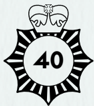

## 111

' So, who have I been talking to? ' Mrs Fellaman asks.

As you advise her the ghost probably took the form of her husband to suit her, you knock on the wall in front of the missing alcove. Your third knock produces a hollow thud.

You  cast  your  eyes  around  the  room  and  spot  Knuckles' discarded masonry hammer. You get a solid two-handed grip and inform Mrs Fellaman that you are about to make a mess. ' Wait a minute, ' she says.

You swing the hammer. The iron head goes through on the first blow.

' He did look like my Victor. How would he know? '

You knock out the loose plaster around the edges of the hole and use your phone as a torch to peer inside. There is a strong flash of carbolic soap and fish guts, the smell of sweat, and a blast  of  cold  that  numbs  your  fingers. Vestigia ! The torch beam casts shadows around a hollow that you quickly recognise  as  the  eye  socket  of  a  skull.  Squinting,  you  see what might be a pile of other bones beneath it-the rest of the skeleton.

' What can you see? '

You  look  at  Mrs  Fellaman.  Perhaps  the  body  was  some mistreated domestic worker from the late 19 th century. Then again, Eugenia Fellaman has quite a temper. Perhaps there was somebody after her beloved Victor who never made it out of the flat.  Nine  times  out  of  ten,  when  the  bones  are removed, the ghost goes with them. You can always borrow Ernie again and take a stroll  along  Prince  of  Wales  Road, just to check.

For now, though, you have a phone call to make. What happens afterwards will not be your problem.

Well done, you've completed your first case file. Welcome to Rivers of London: the Roleplaying Game! THE END.

( 110 )

